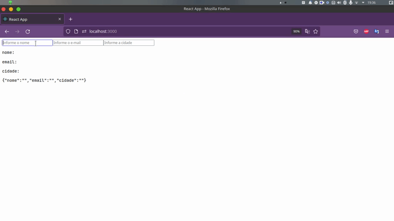

# Temas sobre react



## 🚀 Instalando o repositorio

### Para instalar o repositorio, siga estas etapas:

``` bash
$ git clone https://github.com/yansntss/sobre-react.git
```
### Dentro da pasta, instale as dependencias 
``` bash
  $ yarn
  ou
  $ npm install
```
### Para executar o projeto, rode
``` bash
  $ yarn start
```


## 📝 Licença

Esse projeto está sob licença. Veja o arquivo [LICENÇA](LICENSE.md) para mais detalhes.


